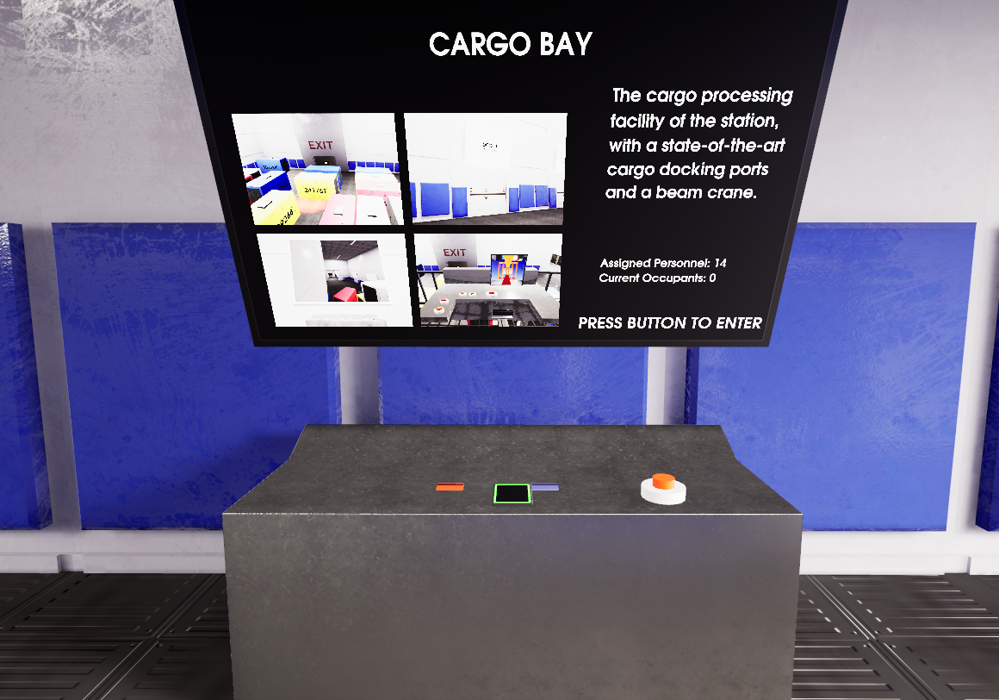
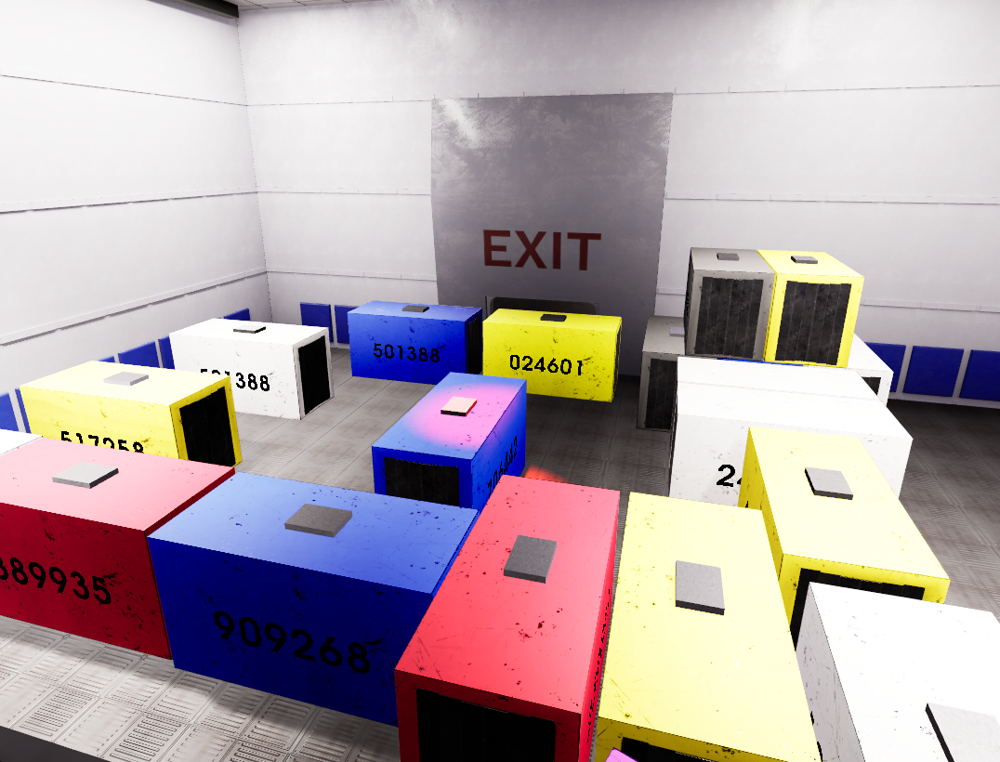
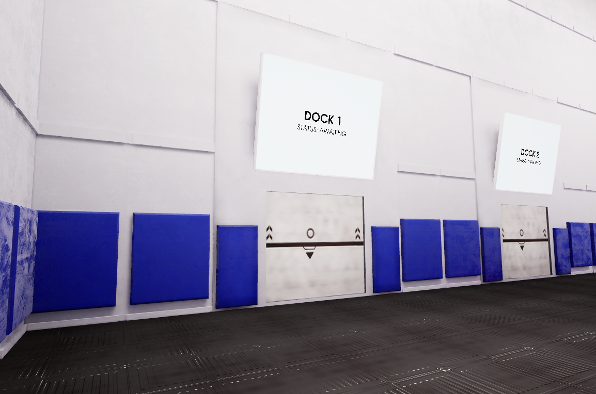
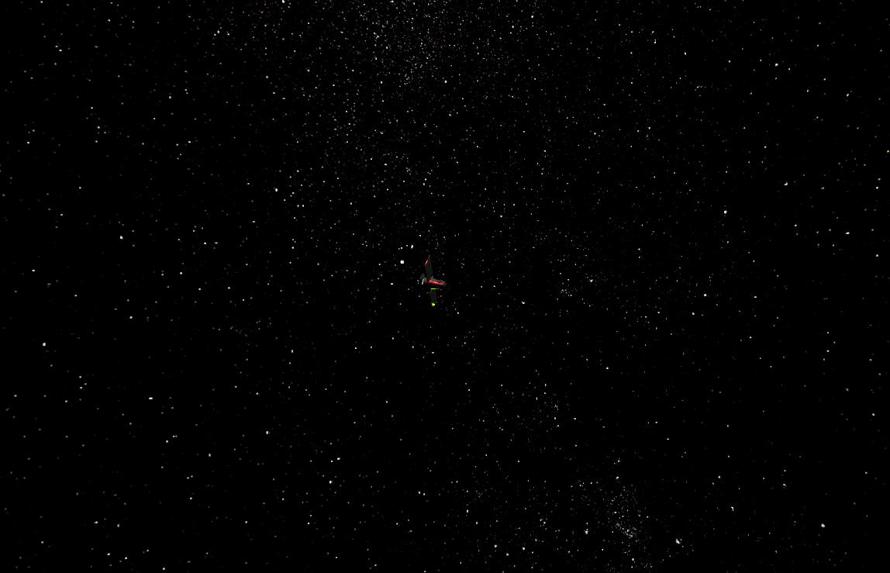
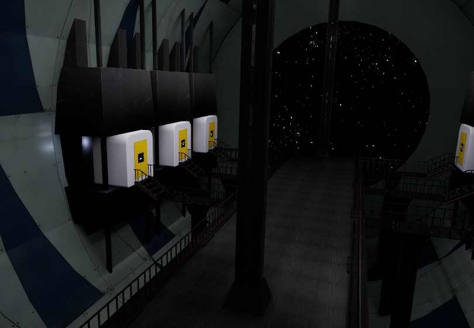

# Erebus II

## Краткое описание

**Erebus II** (от др-греч. Ἔρεβος, «мрак, тьма», вечный мрак) - это игра-головоломка в виртуальной реальности. Игроку предстоит решать различные головоломки, используя различные элементы окружения и предметы.

Вы находитесь на космической станции Erebus II после некоего ЧП. Весь остальной персонал уже покинул станцию (в том или ином смысле). 

**Вам предстоит сбежать со станции, решая головоломки, чтобы найти спасательную капсулу.**

### Сохранение прогресса

Игра сохраняет прогресс автоматически при переходе между секторами. При входе в новый сектор он становится доступен из главного меню для быстрого запуска.

Также для каждого сектора ведётся учёт наиболее быстрого времени прохождения. Это время отображается в главном меню в разделе "**Stats**".

## Управление

**Отклонение правого стика назад** - Телепорт

**Отклонение левого стика влево/вправо** - Поворот на 45 градусов

**Триггер** - Использование предмета/Активация элементов интерфейса в меню и на терминалах при наведении. При возможности взаимодействия с терминалом появляется луч.

**Боковая кнопка** - взять предмет в руку

**Кнопка "Меню" на контроллере** - Меню

## Демо-видео

[Видео на Youtube](https://youtu.be/3Q-oo8owyQI)

[Зеркало на Google Drive](https://drive.google.com/drive/folders/1iL0qFE3IwTa3D608uvFYNc_3tXY8kRl0?usp=sharing)

## Скриншоты

## Запуск

### Игра

Для **запуска игры** необходимо скачать **[билд](https://github.com/NCoolgamer/UE_VRPuzzleGame/releases/)** и распаковать архив. Далее, запустить **VRPuzzleGame.exe**. 

Игра тестировалась на очках виртуальной реальности Oculus Quest 2 и HTC Vive Cosmos на ПК с ОС Windows.

### Редактор

Для скачивания **исходников** проекта необходимо **клонировать** данный репозиторий.

Для **запуска проекта в редакторе** потребуется установить **Unreal Engine** версии **5.3.2** и запустить проект (открыть файл [**.uproject**](./VRPuzzleGame/VRPuzzleGame.uproject) в подпапке **\VRPuzzleGame**).

Так как в репозитории нет запеченных карт света, для корректного отображения проекта потребуется выполнить запечку. 
Для запечки рекомендуется плагин GPU Lightmass.

Для запуска игры из редактора на очках необходимо использовать режим VR Preview.

Также можно запустить игру в режиме Simulate для просмотра проекта без использования очков виртуальной реальности.

Запуск редактора тестировался только на ОС Windows.

# Авторство и разработка

Игра разработана **Орловым Дмитрием** в 2024 году в рамках выполнения задания для поступления в RTU IT Lab по направлению Unreal Engine.

Оригинальный текст задания: "VR игра в жанре головоломок.
Представьте ситуацию, когда ваш друг купил себе новые VR очки и его любимый жанр игр - головоломки. Ваша задача - создать игру с интересными головоломками. Их реализация ограничивается лишь вашим воображением."

Разработка выполнялась на движке **Unreal Engine версии 5.3.2**.

Модели (за некоторыми исключениями, см. ниже) были выполнены в **Blender**, а текстуры и запечка - в **Substance Painter**.

Звуки отредактированы в **Audacity** на основе звуковых эффектов из библиотеки **[freesound](https://freesound.org/)**.

Некоторые текстуры были выполнены в **Inkscape**.

Также использовались стандартные ассеты Unreal Engine, поставляемые вместе с движком.

## Техническая реализация

Игра реализована на Blueprints с упором на модульность и простоту добавления новых уровней и головоломок в будущем.

## Сторонние ассеты

В игре использованы ассеты, созданные другими авторами. Список ассетов и их авторов (в скобках) представлен ниже.

### Скайбокс

The Tycho Catalog Skymap Version 2.0 - https://svs.gsfc.nasa.gov/3572 (NASA)

### Модели

"Space Colony Modular Kit Bash" (https://skfb.ly/ovVRF) (Rakshaan)

### Материалы и текстуры

Metal Panels Facade - id: uehffbmew (Quixel)

AmbientCG: Solar Panel Substance 001 (https://ambientcg.com/view?id=SolarPanelSubstance001) (AmbientCG)

"Space Colony Modular Kit Bash" (https://skfb.ly/ovVRF) (Rakshaan)

### Шрифт

Шрифт URW Gothic - https://fontesk.com/gothic-typeface/ (URW Type Foundry)

### Звуки

- S: Room Tone, Sci Fi, Large Hall by Kinoton | License: Creative Commons 0
- S: Turning On Alert Notification 1_1 by Joao_Janz | License: Creative Commons 0
- S: Error.wav by Autistic Lucario | License: Attribution 4.0
- S: Arc Welding.wav by kev_durr | License: Attribution 4.0
- S: Wrong by Raclure | License: Creative Commons 0
- S: Powerup/success.wav by GabrielAraujo | License: Creative Commons 0
- S: unfa's Menu Sounds by unfa | License: Creative Commons 0
- S: openbottle.flac by Intimidated | License: Attribution 4.0
- S: MechanicalClamp.wav by Skullsmasha | License: Creative Commons 0
- S: pneumatic_door.wav by primeval_polypod | License: Attribution NonCommercial 3.0
- S: Rocket Boost Engine Loop.wav by qubodup | License: Creative Commons 0
- S: Space_Ambient.aif by nathanshadow | License: Sampling+
- S: countdown.wav by tim.kahn | License: Attribution 4.0
- S: FLASH SOUND_dry.aif by jordanthebamf | License: Sampling+